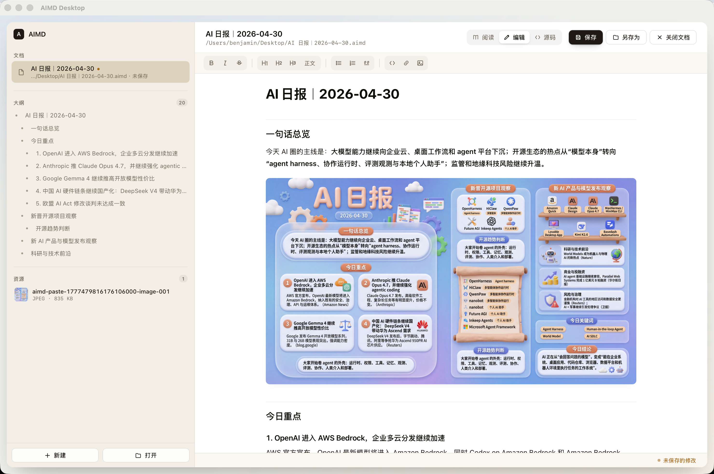

<div align="center">

# AIMD

**把图文文档装进一个文件。**

正文、图片、元信息始终在一起 — 发给别人不丢图，换台电脑也能完整打开。

[下载 macOS 版](#下载) · [下载 Windows 版](#下载) · [它解决什么问题](#为什么会有-aimd) · [文件格式](#文件格式)

</div>



---

## 为什么会有 AIMD

AI 工具正在让 Markdown 变成内容输出的默认格式。日报、调研、教程、周报、Agent 跑出来的报告，几乎都是 Markdown。

但 Markdown 不是一个完整的"文档"：

- 图片散在文件夹里，一拖动就断了
- 发给同事，对方不会装编辑器
- 想存档，过几个月发现配图全丢了
- 转成 PDF，就不能再编辑了

`.aimd` 是一个开放格式 — 一个 ZIP 容器，里面装着 Markdown 正文、所有图片，以及元数据。**一个文件，发哪儿都齐整。**

AIMD Desktop 是配套的桌面应用：双击 `.aimd` 就打开，像看 Markdown 一样阅读，像写 Markdown 一样编辑，图片直接粘贴进文档里就和正文绑在一起了。

---

## 给谁用

- **写 AI 日报 / 调研报告的你** — AI 给你的内容连图带表，存成 `.aimd`，发给老板、扔进群里、归档，都是一个文件搞定
- **整理技术文档的你** — 截图、流程图、架构图直接粘进编辑器，不用单独管 `images/` 目录
- **跑 Agent 输出的你** — 让 Agent 直接产出 `.aimd`（ZIP + manifest，结构透明），未来还能记录模型、提示词、出处

---

## 你能在 AIMD Desktop 里做什么

### 一个文件，三种看法

- **阅读模式** — 干净的排版，专注读
- **编辑模式** — 所见即所得，直接在渲染好的页面上改字、加粗、贴图
- **源码模式** — 左边写 Markdown，右边实时预览

顶部一键切换；正常 / 加宽 / 超宽三档版面，长图大表也舒服。

### 图片就该跟正文走

- **粘贴即入文档** — 截图直接 ⌘V，图自动塞进 `.aimd`，不再是外部链接
- **自动去重 + 压缩** — 同一张图复制多次只存一份；大图按需压缩，文件不臃肿
- **保存自动清理** — 删掉的图片，不再被引用的资源，会在保存时一起 GC 掉

### 拖、双击、关联，怎么自然怎么来

- 直接把 `.aimd` 拖进窗口，立刻打开
- 系统里双击 `.aimd` 文件，自动用 AIMD 启动
- 也能直接打开普通 `.md` 文件，按需另存为 `.aimd` 升级
- 多窗口同时开多个文档（⌘⇧N），互不干扰

### 还顺手的细节

- 左侧自动生成大纲，跳转章节；下面是资源面板，文档里所有图片一目了然
- 点图片即放大灯箱，按 Esc 收起
- 最近打开列表，丢了文件路径也能回到现场
- 完整快捷键：⌘N 新建 / ⌘O 打开 / ⌘S 保存 / ⇧⌘S 另存为 / ⌘W 关闭

---

## 下载

桌面应用支持 **macOS** 和 **Windows**。

| 平台 | 文件 | 安装 |
|---|---|---|
| macOS (Apple Silicon) | [`AIMD.Desktop_0.1.0_aarch64.dmg`](https://github.com/benjamin1108/aimd/releases/download/v0.1.0/AIMD.Desktop_0.1.0_aarch64.dmg) | 双击挂载，把 AIMD 拖进 Applications |
| Windows 10/11 (x64) | [`AIMD.Desktop_0.1.0_x64-setup.exe`](https://github.com/benjamin1108/aimd/releases/download/v0.1.0/AIMD.Desktop_0.1.0_x64-setup.exe) | 双击安装 |

> 当前版本为 `v0.1.0`，可在 [Releases](https://github.com/benjamin1108/aimd/releases/tag/v0.1.0) 下载。

首次打开 `.aimd` 文件时，建议在系统中右键 → "打开方式" → "始终用 AIMD 打开"，之后双击即可。

---

## 文件格式

`.aimd` 就是一个普通 ZIP，结构透明，可以用任何解压工具打开看：

```text
report.aimd
├── manifest.json     文档元信息、资源清单、SHA-256
├── main.md           Markdown 正文
└── assets/           打包进来的图片和资源
    ├── cover.png
    └── chart-001.png
```

正文里的图片用稳定引用形式 ``，移动文件、改名字、跨平台，都不会断。

**为什么不直接用 PDF？** PDF 是给人看的终点，AIMD 是给人编辑的中间格式 — 可读、可改、可归档、可被脚本和 Agent 处理。

**为什么不直接用 Markdown + images 文件夹？** 那个组合发出去就散架。AIMD 是同一个东西，但只剩一个文件。

---

## 从源码构建

桌面应用基于 [Tauri 2](https://tauri.app/)（Rust + TypeScript）。

需要：Node.js 18+，Rust（cargo），平台对应工具链（macOS 需 Xcode CLT，Windows 需 MSVC + WebView2）。

```bash
# 克隆
git clone https://github.com/<your-org>/aimd.git
cd aimd

# 开发运行
cd apps/desktop
npm install
npm run dev          # 启动 Tauri dev 窗口

# 类型检查 + 端到端
npm run typecheck
npm run test:e2e
```

打包发布：

```bash
# macOS — 产出 .dmg / .app 到 dist/
./build-dmg.sh

# Windows — 产出 .exe / .msi 到 dist/
build-windows.bat
```

仓库里附了一个示例文档可以直接打开看效果：[`examples/ai-daily-2026-04-30.aimd`](examples/ai-daily-2026-04-30.aimd)。

---

## 仓库结构

```text
aimd/
├── apps/desktop/        Tauri 桌面应用（前端 TS + 后端 Rust）
├── crates/
│   ├── aimd-core/       .aimd ZIP 容器读写
│   ├── aimd-mdx/        Markdown 解析与改写
│   └── aimd-render/     渲染管线
├── skill/               Claude Code skill —— 让 AI Agent 直接读写 .aimd
└── examples/            示例文档
```

`skill/` 目录里是一个可以装到 Claude Code 的 skill，让 AI 能直接用 Python 脚本读写 `.aimd`，把 AI 生成的内容打包进来。

---

## 路线图

**已交付（v0.1）**

- `.aimd` 单文件容器：manifest + main.md + assets，SHA-256 校验
- macOS / Windows 桌面应用：阅读 / 编辑 / 源码三模式，多窗口
- 图片粘贴、去重、按需压缩、保存时 GC
- 普通 `.md` 兼容打开与按需升级
- 文件关联、最近打开、会话恢复

**接下来**

- AI 出处与溯源元信息（模型、提示词、来源引用、审阅状态）
- 文档健康检查（缺图、断链、过大资源、结构异常）
- 更多导出方式：自渲染 HTML、PDF
- 浏览器在线查看器
- 文件格式正式规范与 SDK

---

## License

TBD.
