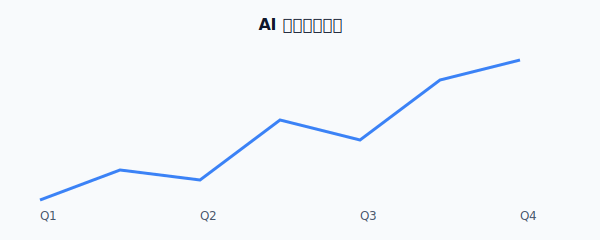

# AIMD 示例：AI 市场分析报告

这是一份用来演示 AIMD 打包能力的样例文档。

## 概述

AIMD 把 Markdown 正文、图片资源与文档元信息封装在一个 `.aimd` 文件里。
即使原始资源文件夹丢失，文档依旧可以独立预览。

## 趋势

下图展示一个示意趋势：

## 远程图片

下面这张图来自远程地址，v0.1 默认不会下载：

## 结论

只要把 `report.md` 与 `images/` 一起放在同一目录，运行 `aimd pack report.md` 即可生成 `report.aimd`。
